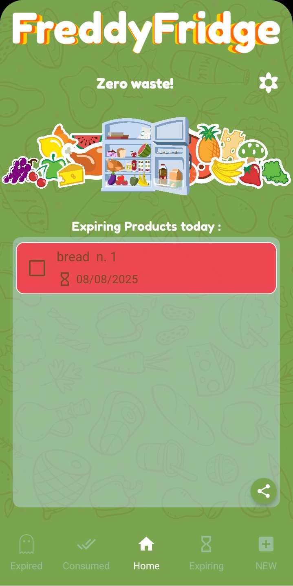
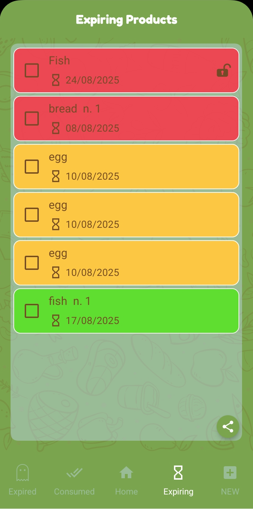
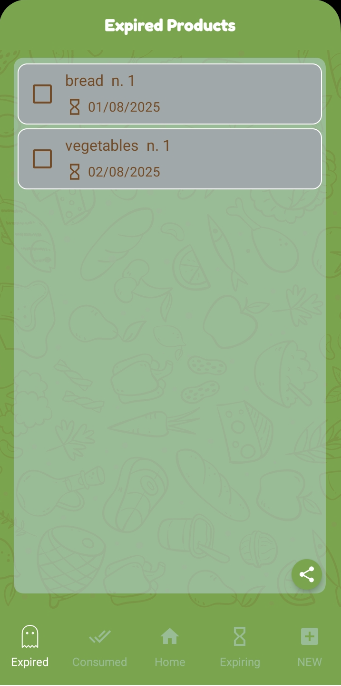
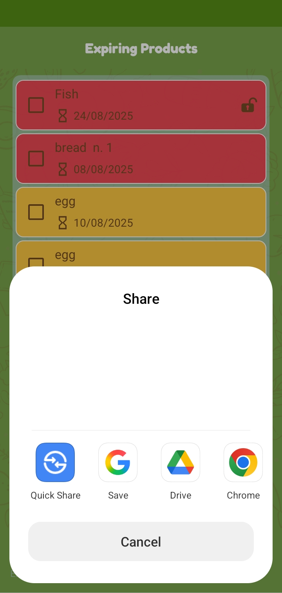
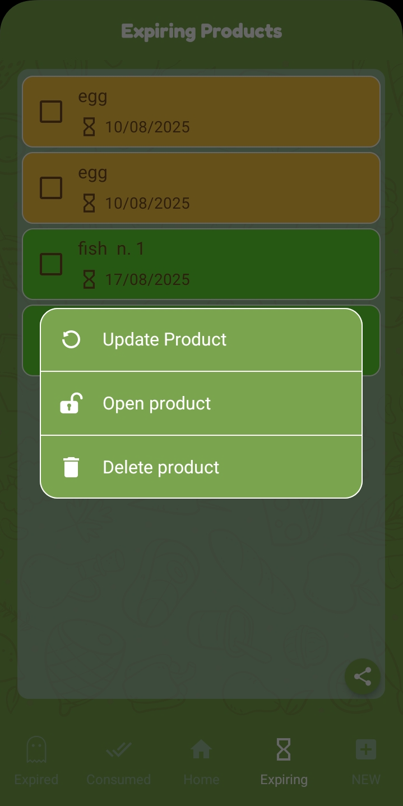
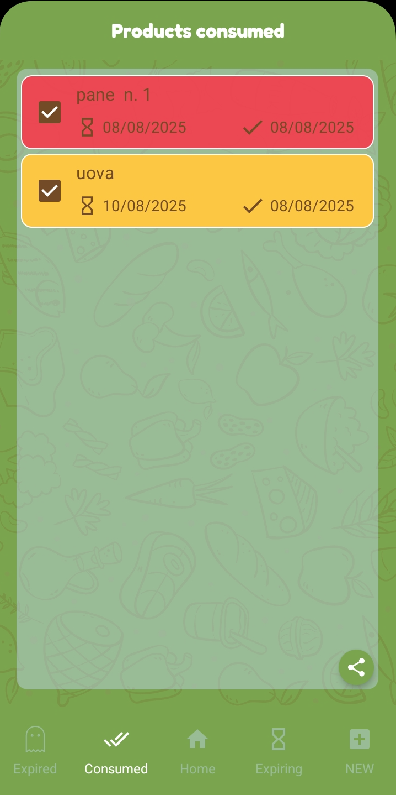

 

# FreddyFridge, a Fridge Manager and food expiring date app

A smart Fridge Manager free app for wasting food no more !	

It is easy to use, do not forget no more food expiration date and stop wasting your food.

Check out it on [Google Play](https://play.google.com/store/apps/details?id=eu.indiewalkabout.fridgemanager)!

**Main features** :

- insert easily your food description by writing or by speech recognition, and the expiring date.

- be aware through notifications when your food is going to expire : FreddyFridge remembers for you!

- keep a  list of expiring food in the next days, and another for expiring food today

- keep track of your consumed food in a specific list

- small sized and optimized app

- beautiful and relaxing graphic

**Screenshots** :

Here's a glimpse of FreddyFridge in action:

   
  
  
  

  
  
  

 

**Contributions?**
Yes please! Every help would be really appreciated! Check out here for easy how-to :
See [CONTRIBUTING.md](https://github.com/nadar71/FreddyFridge/blob/master/CONTRIBUTING.md)
Thank you a lot! :smiley:
